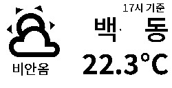

# hass-gicisky
Gicisky BLE Label Home Assistant Integration

## Gallery
| Size | Example |
|------|---------|
| 2.1" (250x128) |  |
| 2.9" (296x128) |  |
| 4.2" (400x300) |  |

## What Is an Electronic Label?

An **Electronic Label** (also known as an **Electronic Shelf Label, ESL**) is a small display device that uses  
**electronic paper (e-paper)** instead of traditional paper.

Once content is displayed, it remains visible **without consuming power**,  
making electronic labels extremely energy-efficient and well suited for always-on information display.

This project uses electronic labels manufactured by **Gicisky**.

## Key Characteristics

- 📄 **E-paper display**
  - Paper-like appearance with excellent readability
- 🔋 **Ultra-low power consumption**
  - Power is only used when the display is updated
- 📡 **Wireless communication**
  - Display content can be updated remotely
- 📐 **Compact and lightweight**
  - Easy to mount on walls, shelves, doors, or devices

Although electronic labels are commonly associated with retail price tags,  
their core value lies in being **small, persistent, and power-efficient displays**.

## Why Electronic Labels?

Electronic labels are ideal for displaying information that:

- Needs to be visible at all times
- Does not change frequently
- Must be shown in locations where continuous power is impractical

This project focuses on these fundamental characteristics and explores electronic labels  
beyond their traditional use cases.


## 💬 Feedback & Support

🐞 Found a bug? Let us know via an [Issue](https://github.com/eigger/hass-gicisky/issues).  
💡 Have a question or suggestion? Join the [Discussion](https://github.com/eigger/hass-gicisky/discussions)!


## Supported Models
- TFT 2.1" BW (250x132)
- EPD 2.1" BWR (250x128)
- EPD 2.9" BWR (296x128)
- EPD 4.2" BWR (400x300)
- EPD 7.5" BWR (800x480)

## Installation
1. Install this integration with HACS (adding repository required), or copy the contents of this
repository into the `custom_components/gicisky` directory.
2. Restart Home Assistant.

## ⚠️ Important Notice
- It is **strongly recommended to use a Bluetooth proxy instead of a built-in Bluetooth adapter**.  
  Bluetooth proxies generally offer more stable connections and better range, especially in environments with multiple BLE devices.
- When using a Bluetooth proxy, it is strongly recommended to **keep the scan interval at its default value**.  
  Changing these values may cause issues with Bluetooth data transmission.
- **bluetooth_proxy:** must always have **active: true**.
  
  Example (recommended configuration with default values):

  ```yaml
  esp32_ble_tracker:
    scan_parameters:
      active: true
  
  bluetooth_proxy:
    active: true


## Examples
| Size | Example | Preview | Yaml |
|------|---------|---------|------|
| 2.1" (250x128) | Date |  | [2.1" Date](./examples/2.1-date.yaml) |
| 2.1" (250x128) | Naver Weather |  | [2.1" Naver Weather](./examples/2.1-naver-weather.yaml) |
| 2.1" (250x128) | Waste Collection |  | [2.1" Waste Collection](./examples/2.1-waste-collection.yaml) |
| 2.1" (250x128) | Wifi |  | [2.1" Wifi](./examples/2.1-wifi.yaml) |
| 2.1" (250x128) | TMap time |  | [2.1" TMap time](./examples/2.1-tmap-time.yaml) |
| 2.9" (296x128) | Google Calendar |  | [2.9" Google Calendar](./examples/2.9-google-calendar.yaml) |
| 2.9" (296x128) | Presence Display |  | [2.9" Presence Display](./examples/2.9-presence-display.yaml) |
| 4.2" (400x300) | Image |  | [4.2" Image](./examples/4.2-image.yaml) |
| 4.2" (400x300) | Naver Weather |  | [4.2" Naver Weather](./examples/4.2-naver-weather.yaml) |
| 4.2" (400x300) | Date Weather |  | [4.2" Date Weather](./examples/4.2-date-weather.yaml) |
| 4.2" (400x300) | 3D Print |  | [4.2" 3D Print](./examples/4.2-3d-print.yaml) |
| 7.5" (800x480) | Google Calendar |  | [7.5" Google Calendar](./examples/7.5-google-calendar.yaml) |
| 7.5" (800x480) | Date Weather |  | [7.5" Date Weather](./examples/7.5-date-weather.yaml) |
```yaml
action: gicisky.write
data:
  rotate: 0 or 90 or 180 or 270
  background: white or black or red
  payload:
    - type: text
      value: Hello World!
      x: 10
      y: 10
      size: 40
    - type: barcode
      data: "12345"
      code: "code128"
      x: 10
      y: 10
    - type: icon
      value: account-cowboy-hat
      x: 6
      y: 12
      size: 12
    - type: dlimg
      url: "https://image url.png" or "/config/www/images/image.png"
      x: 10
      y: 10
      xsize: 12
      ysize: 12
    - type: qrcode
      data: "qr data"
      x: 140
      y: 50
      boxsize: 2
      border: 2
target:
  device_id: <your device>
```
## Internal Font List
  - fonts/CookieRunBlack.ttf
  - fonts/CookieRunBold.ttf
  - fonts/CookieRunRegular.ttf
  - fonts/GmarketSansTTFBold.ttf
  - fonts/GmarketSansTTFLight.ttf
  - fonts/GmarketSansTTFMedium.ttf
  - fonts/NotoSansKR-Black.ttf
  - fonts/NotoSansKR-Bold.ttf
  - fonts/NotoSansKR-ExtraBold.ttf
  - fonts/NotoSansKR-ExtraLight.ttf
  - fonts/NotoSansKR-Light.ttf
  - fonts/NotoSansKR-Medium.ttf
  - fonts/NotoSansKR-Regular.ttf
  - fonts/NotoSansKR-SemiBold.ttf
  - fonts/NotoSansKR-Thin.ttf
  - fonts/OwnglyphParkDaHyun.ttf

## Payload Element Types
| **Type**              | **Required Fields**                                                                      | **Optional Fields**                                                                                                              | **Description**                                                 |
| --------------------- | ---------------------------------------------------------------------------------------- | -------------------------------------------------------------------------------------------------------------------------------- | --------------------------------------------------------------- |
| **text**              | `x`, `value`                                                                             | `y`, `size`, `font`, `color`, `anchor`, `align`, `spacing`, `stroke_width`, `stroke_fill`, `max_width`, `y_padding`              | Draws single-line text (auto-wrap if `max_width` provided).     |
| **multiline**         | `x`, `value`, `delimiter`                                                                | `start_y`, `offset_y`, `size`, `font`, `color`, `anchor`, `stroke_width`, `stroke_fill`, `y_padding`                             | Splits text by a delimiter and draws lines sequentially.        |
| **line**              | `x_start`, `x_end`                                                                       | `y_start`, `y_end`, `fill`, `width`, `y_padding`                                                                                 | Draws a straight line. If no `y_start`, auto-stacks vertically. |
| **rectangle**         | `x_start`, `x_end`, `y_start`, `y_end`                                                   | `fill`, `outline`, `width`, `radius`, `corners`                                                                                  | Draws a rectangle with optional rounded corners.                |
| **rectangle_pattern** | `x_start`, `y_start`, `x_size`, `y_size`, `x_repeat`, `y_repeat`, `x_offset`, `y_offset` | `fill`, `outline`, `width`, `radius`, `corners`                                                                                  | Repeated grid of rectangles (pattern/tiling).                   |
| **circle**            | `x`, `y`, `radius`                                                                       | `fill`, `outline`, `width`                                                                                                       | Draws a circle at center (`x`, `y`).                            |
| **ellipse**           | `x_start`, `x_end`, `y_start`, `y_end`                                                   | `fill`, `outline`, `width`                                                                                                       | Draws an ellipse inside a bounding box.                         |
| **icon**              | `x`, `y`, `value`, `size`                                                                | `color`/`fill`, `anchor`, `stroke_width`, `stroke_fill`                                                                          | Draws Material Design Icons via metadata JSON.                  |
| **dlimg**             | `x`, `y`, `url`, `xsize`, `ysize`                                                        | `rotate`                                                                                                                         | Downloads/loads an image, resizes and draws it.                 |
| **qrcode**            | `x`, `y`, `data`                                                                         | `color`, `bgcolor`, `border`, `boxsize`                                                                                          | Generates and embeds a QR code.                                 |
| **barcode**           | `x`, `y`, `data`                                                                         | `color`, `bgcolor`, `code`, `module_width`, `module_height`, `quiet_zone`, `font_size`, `text_distance`, `write_text`            | Draws various barcode formats (Code128 default).                |
| **diagram**           | `x`, `y`, `height`                                                                       | `width`, `margin`, `bars:{values,color,margin,legend_size,legend_color}`                                                         | Creates a simple bar chart with axes.                           |
| **plot**              | `data:[{entity}]`                                                                        | `duration`, `x_start`, `y_start`, `x_end`, `y_end`, `size`, `font`, `ylegend`, `yaxis`, `low`, `high`, `color`, `width`, `debug` | Time-series graph from Home Assistant Recorder history.         |
| **progress_bar**      | `x_start`, `x_end`, `y_start`, `y_end`, `progress`                                       | `direction`, `background`, `fill`, `outline`, `width`, `show_percentage`                                                         | Draws a progress bar with optional % label.                     |

## [Gicisky Image Edit & Uploader](https://eigger.github.io/Gicisky_Image_Uploader.html)

## T-Map
```
#https://openapi.sk.com/products/detail?linkMenuSeq=46
rest_command:
  request_tmap_routes:
    url: https://apis.openapi.sk.com/tmap/routes?version=1
    method: POST
    headers:
      appKey: !secret tmap_api_key
      accept: "application/json, text/html"
    content_type: "application/json; charset=utf-8"
    payload: >-
      {
        "startX": {{ startX }},
        "startY": {{ startY }},
        "endX": {{ endX }},
        "endY": {{ endY }},
        "searchOption": {{ searchOption }},
        "totalValue": 2,
        "trafficInfo ": "Y",
        "mainRoadInfo": "Y",
      }
```

## Google Calendar
```
Remote Calendar -> Add google *.ics
```

## Third-Party Custom Components
- [Naver Weather (minumida)](https://github.com/miumida/naver_weather.git)
- [Waste Collection Schedule (mampfes)](https://github.com/mampfes/hacs_waste_collection_schedule.git)
  
## References
- [ATC GICISKY ESL (atc1441)](https://github.com/atc1441/ATC_GICISKY_ESL.git)
- [OpenEPaperLink](https://github.com/OpenEPaperLink/Home_Assistant_Integration.git)
- [bthome](https://github.com/home-assistant/core/tree/dev/homeassistant/components/bthome)
- [bthome-ble](https://github.com/Bluetooth-Devices/bthome-ble.git)
