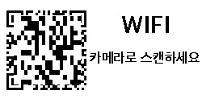

# hass-gicisky

Gicisky BLE Label Home Assistant Integration

## Gallery

| Size | Example |
|------|---------| 
| 2.1" (250x128) |  |
| 2.9" (296x128) |  |
| 4.2" (400x300) |  |

## What Is an Electronic Label?

An **Electronic Label** (also known as an **Electronic Shelf Label, ESL**) is a small display device that uses  
**electronic paper (e-paper)** instead of traditional paper.

Once content is displayed, it remains visible **without consuming power**,  
making electronic labels extremely energy-efficient and well suited for always-on information display.

This project uses electronic labels manufactured by **Gicisky**.

## Key Characteristics

- 📄 **E-paper display**
  - Paper-like appearance with excellent readability
- 🔋 **Ultra-low power consumption**
  - Power is only used when the display is updated
- 📡 **Wireless communication**
  - Display content can be updated remotely
- 📐 **Compact and lightweight**
  - Easy to mount on walls, shelves, doors, or devices

Although electronic labels are commonly associated with retail price tags,  
their core value lies in being **small, persistent, and power-efficient displays**.

## Why Electronic Labels?

Electronic labels are ideal for displaying information that:

- Needs to be visible at all times
- Does not change frequently
- Must be shown in locations where continuous power is impractical

This project focuses on these fundamental characteristics and explores electronic labels  
beyond their traditional use cases.

## 💬 Feedback & Support

🐞 Found a bug? Let us know via an [Issue](https://github.com/eigger/hass-gicisky/issues).  
💡 Have a question or suggestion? Join the [Discussion](https://github.com/eigger/hass-gicisky/discussions)!

---

## Supported Models

| Type | Size | Resolution | Colors |
|------|------|------------|--------|
| TFT | 2.1" | 250 × 132 | BW |
| EPD | 2.1" | 250 × 128 | BWR |
| EPD | 2.9" | 296 × 128 | BWR |
| EPD | 2.9" | 296 × 128 | BWRY |
| EPD | 4.2" | 400 × 300 | BWR |
| EPD | 7.5" | 800 × 480 | BWR |
| EPD | 10.2" | 960 × 640 | BWR |

## Installation

1. Install this integration with HACS (adding repository required), or copy the contents of this
repository into the `custom_components/gicisky` directory.
2. Restart Home Assistant.

## ⚠️ Important Notice

- It is **strongly recommended to use a Bluetooth proxy instead of a built-in Bluetooth adapter**.  
  Bluetooth proxies generally offer more stable connections and better range, especially in environments with multiple BLE devices.

> [!TIP]
> For hardware recommendations, refer to [Great ESP32 Board for an ESPHome Bluetooth Proxy](https://community.home-assistant.io/t/great-esp32-board-for-an-esphome-bluetooth-proxy/916767/31).  
- When using a Bluetooth proxy, it is strongly recommended to **keep the scan interval at its default value**.  
  Changing these values may cause issues with Bluetooth data transmission.
- **bluetooth_proxy:** must always have **active: true**.

  Example (recommended configuration with default values):

  ```yaml
  esp32_ble_tracker:
    scan_parameters:
      active: true

  bluetooth_proxy:
    active: true
  ```

## Options

After adding a device, you can configure the following options via **Settings > Devices & Services > Gicisky > Configure**:

| Option | Default | Range | Description |
|--------|---------|-------|-------------|
| **Retry Count** | 3 | 1–10 | Number of retry attempts when BLE write fails |
| **Write Delay (ms)** | 0 | 0–1000 | Delay in milliseconds between each BLE write operation |

> [!TIP]
> If you experience frequent write failures, try increasing the **Retry Count**.  
> If writes are unstable, try setting **Write Delay** to 50–100 ms to give the device more time to process each packet.

---

## Service: `gicisky.write`

### Service Parameters

| Parameter | Required | Default | Description |
|-----------|----------|---------|-------------|
| `payload` | ✅ | — | List of drawing elements (see [Payload Element Types](#payload-element-types)) |
| `rotate` | ❌ | `0` | Image rotation: `0`, `90`, `180`, `270` |
| `background` | ❌ | `white` | Background color: `white`, `black`, `red` |
| `threshold` | ❌ | `128` | Black binary threshold (`0`–`255`) |
| `red_threshold` | ❌ | `128` | Red binary threshold (`0`–`255`) |
| `dry_run` | ❌ | `false` | Generate preview image without sending to device |

### Basic Usage

```yaml
action: gicisky.write
data:
  payload:
    - type: text
      value: Hello World!
      x: 10
      y: 10
      size: 40
target:
  device_id: <your device>
```

### Rotation & Background

```yaml
action: gicisky.write
data:
  rotate: 90
  background: black
  payload:
    - type: text
      value: Rotated!
      x: 10
      y: 10
      size: 30
      color: white
target:
  device_id: <your device>
```

### Dry Run (Preview Only)

> Preview image is available via the **Camera** entity without sending data to the physical device.

> [!TIP]
> You can use the **[Gicisky Payload Editor](https://eigger.github.io/Gicisky_Payload_Editor.html)** to design a rough layout via drag-and-drop in your browser and automatically generate YAML. Use the generated YAML with `dry_run: true` to preview it without sending data to the actual device.

```yaml
action: gicisky.write
data:
  dry_run: true
  payload:
    - type: text
      value: Preview Test
      x: 10
      y: 10
      size: 30
target:
  device_id: <your device>
```

---

### Payload Element Examples

> [!TIP]
> All elements support the `visible` field (`true`/`false`) to conditionally show or hide them.

#### text

```yaml
- type: text
  value: "Hello World!"
  x: 10
  y: 10
  size: 40
  font: "fonts/NotoSansKR-Bold.ttf"
  color: black
  anchor: lt            # Pillow anchor (e.g. lt, mt, rt, lm, mm, rm)
  align: left           # left, center, right
  spacing: 5
  stroke_width: 1
  stroke_fill: white
  max_width: 200        # Auto-wrap text within this pixel width
```

If `y` is omitted the element stacks below the previous element automatically (`y_padding` controls the gap, default `10`).

#### multiline

```yaml
- type: multiline
  value: "Line1;Line2;Line3"
  delimiter: ";"
  x: 10
  start_y: 10           # Starting Y position (auto-stacks if omitted)
  offset_y: 25           # Y spacing between lines (required)
  size: 20
  font: "fonts/NotoSansKR-Regular.ttf"
  color: black
  anchor: lm
  stroke_width: 0
  stroke_fill: white
```

#### line

```yaml
- type: line
  x_start: 0
  x_end: 250
  y_start: 64
  y_end: 64
  fill: black
  width: 2
```

If `y_start` is omitted the line is drawn at the current auto-stack Y position (`y_padding` offset).

#### rectangle

```yaml
- type: rectangle
  x_start: 5
  y_start: 5
  x_end: 100
  y_end: 60
  fill: red
  outline: black
  width: 2
  radius: 10            # Corner radius for rounded rectangle
  corners: "top_left,top_right"  # all / top_left / top_right / bottom_right / bottom_left
```

#### rectangle_pattern

```yaml
- type: rectangle_pattern
  x_start: 10
  y_start: 10
  x_size: 20
  y_size: 20
  x_repeat: 5
  y_repeat: 3
  x_offset: 5
  y_offset: 5
  fill: black
  outline: black
  width: 1
  radius: 5
  corners: "all"
```

#### circle

```yaml
- type: circle
  x: 125               # Center X
  y: 64                 # Center Y
  radius: 30
  fill: red
  outline: black
  width: 2
```

#### ellipse

```yaml
- type: ellipse
  x_start: 50
  y_start: 20
  x_end: 200
  y_end: 100
  fill: red
  outline: black
  width: 1
```

#### icon

Uses [Material Design Icons](https://pictogrammers.com/library/mdi/). You can use the icon name with or without the `mdi:` prefix.

```yaml
- type: icon
  value: "weather-sunny"     # or "mdi:weather-sunny"
  x: 10
  y: 10
  size: 48
  color: black               # or use fill
  anchor: la
  stroke_width: 0
  stroke_fill: white
```

#### dlimg

Supports **HTTP/HTTPS URLs**, **local file paths**, and **Base64 data URIs**.

```yaml
- type: dlimg
  url: "https://example.com/image.png"
  x: 10
  y: 10
  xsize: 100
  ysize: 100
  rotate: 0
```

```yaml
# Local file
- type: dlimg
  url: "/config/www/images/photo.png"
  x: 0
  y: 0
  xsize: 250
  ysize: 128
```

```yaml
# Base64 data URI
- type: dlimg
  url: "data:image/png;base64,iVBORw0KGgo..."
  x: 10
  y: 10
  xsize: 50
  ysize: 50
```

#### qrcode

```yaml
- type: qrcode
  data: "https://www.home-assistant.io"
  x: 140
  y: 10
  boxsize: 2
  border: 1
  color: black
  bgcolor: white
```

#### barcode

```yaml
- type: barcode
  data: "123456789012"
  x: 10
  y: 80
  code: code128             # code128, ean13, ean8, upc, isbn13, etc.
  color: black
  bgcolor: white
  module_width: 0.2
  module_height: 7
  quiet_zone: 6.5
  font_size: 5
  text_distance: 5.0
  write_text: true
```

#### diagram

```yaml
- type: diagram
  x: 0
  y: 0
  width: 250
  height: 128
  margin: 20
  font: "fonts/NotoSansKR-Regular.ttf"
  bars:
    values: "Mon,10;Tue,25;Wed,15;Thu,30;Fri,20"
    color: black
    margin: 10
    legend_size: 10
    legend_color: black
```

#### plot

Reads entity history from **Home Assistant Recorder**.

```yaml
- type: plot
  data:
    - entity: sensor.temperature
      color: black
      width: 2
  duration: 86400          # Seconds (default: 86400 = 1 day)
  x_start: 30
  y_start: 10
  x_end: 290
  y_end: 120
  size: 10
  font: "fonts/NotoSansKR-Regular.ttf"
  low: 15                  # Fixed Y-axis minimum
  high: 35                 # Fixed Y-axis maximum
  ylegend:
    width: -1              # Auto-calculate
    color: black
    position: left         # left or right
  yaxis:
    width: 1
    color: black
    tick_width: 2
    tick_every: 5
    grid: 5
    grid_color: black
  debug: false
```

#### progress_bar

```yaml
- type: progress_bar
  x_start: 10
  y_start: 100
  x_end: 240
  y_end: 120
  progress: 75
  direction: right          # right, left, up, down
  background: white
  fill: red
  outline: black
  width: 1
  show_percentage: true
```

---

### Combined Example

```yaml
action: gicisky.write
data:
  rotate: 0
  background: white
  payload:
    - type: text
      value: "Home Status"
      x: 10
      y: 5
      size: 24
      font: "fonts/NotoSansKR-Bold.ttf"
    - type: line
      x_start: 0
      x_end: 250
      y_start: 35
      y_end: 35
      fill: black
      width: 1
    - type: icon
      value: thermometer
      x: 10
      y: 45
      size: 24
      color: black
    - type: text
      value: "{{ states('sensor.temperature') }}°C"
      x: 40
      y: 48
      size: 20
    - type: progress_bar
      x_start: 10
      y_start: 80
      x_end: 240
      y_end: 95
      progress: "{{ states('sensor.humidity') | int }}"
      direction: right
      fill: black
      show_percentage: true
    - type: qrcode
      data: "https://www.home-assistant.io"
      x: 180
      y: 40
      boxsize: 2
      border: 1
target:
  device_id: <your device>
```

---

## Payload Element Types

> [!TIP]
> All elements support the `visible` field (`true`/`false`, default: `true`) to conditionally show or hide them.

| **Type**              | **Required Fields**                                                                       | **Optional Fields**                                                                                                                        | **Description**                                                 |
| --------------------- | ----------------------------------------------------------------------------------------- | ------------------------------------------------------------------------------------------------------------------------------------------ | --------------------------------------------------------------- |
| **text**              | `x`, `value`                                                                              | `y`, `size`(20), `font`, `color`(black), `anchor`(lt), `align`(left), `spacing`(5), `stroke_width`(0), `stroke_fill`(white), `max_width`, `y_padding`(10) | Draws text (auto-wrap if `max_width` provided). Auto-stacks if `y` omitted. |
| **multiline**         | `x`, `value`, `delimiter`, `offset_y`                                                     | `start_y`, `size`(20), `font`, `color`(black), `anchor`(lm), `stroke_width`(0), `stroke_fill`(white), `y_padding`(10)                      | Splits text by delimiter and draws each line with `offset_y` spacing. |
| **line**              | `x_start`, `x_end`                                                                        | `y_start`, `y_end`, `fill`(black), `width`(1), `y_padding`(0)                                                                              | Draws a straight line. Auto-stacks if `y_start` omitted.        |
| **rectangle**         | `x_start`, `x_end`, `y_start`, `y_end`                                                    | `fill`, `outline`(black), `width`(1), `radius`(0), `corners`(all)                                                                          | Draws a rectangle with optional rounded corners.                 |
| **rectangle_pattern** | `x_start`, `y_start`, `x_size`, `y_size`, `x_repeat`, `y_repeat`, `x_offset`, `y_offset`  | `fill`, `outline`(black), `width`(1), `radius`(0), `corners`(all)                                                                          | Repeated grid of rectangles (pattern/tiling).                    |
| **circle**            | `x`, `y`, `radius`                                                                        | `fill`, `outline`(black), `width`(1)                                                                                                       | Draws a circle at center (`x`, `y`).                             |
| **ellipse**           | `x_start`, `x_end`, `y_start`, `y_end`                                                    | `fill`, `outline`(black), `width`(1)                                                                                                       | Draws an ellipse inside a bounding box.                          |
| **icon**              | `x`, `y`, `value`, `size`                                                                 | `color`/`fill`(black), `anchor`(la), `stroke_width`(0), `stroke_fill`(white)                                                               | Draws [Material Design Icons](https://pictogrammers.com/library/mdi/). Supports `mdi:` prefix. |
| **dlimg**             | `x`, `y`, `url`, `xsize`, `ysize`                                                         | `rotate`(0)                                                                                                                                | Loads image from URL, local path, or Base64 data URI.            |
| **qrcode**            | `x`, `y`, `data`                                                                          | `color`(black), `bgcolor`(white), `border`(1), `boxsize`(2)                                                                                | Generates and embeds a QR code.                                  |
| **barcode**           | `x`, `y`, `data`                                                                          | `color`(black), `bgcolor`(white), `code`(code128), `module_width`(0.2), `module_height`(7), `quiet_zone`(6.5), `font_size`(5), `text_distance`(5.0), `write_text`(true) | Draws various barcode formats.                |
| **diagram**           | `x`, `y`, `height`                                                                        | `width`(canvas), `margin`(20), `font`, `bars`                                                                                              | Creates a bar chart. `bars` object: `values`(required, `"name,val;..."`) `color`(required), `margin`(10), `legend_size`(10), `legend_color`(black). |
| **plot**              | `data`([{`entity`}])                                                                      | `duration`(86400), `x_start`(0), `y_start`(0), `x_end`, `y_end`, `size`(10), `font`, `low`, `high`, `ylegend`, `yaxis`, `debug`(false)      | Time-series graph from HA Recorder. Per-series: `entity`(required), `color`(black), `width`(1), `joint`. |
| **progress_bar**      | `x_start`, `x_end`, `y_start`, `y_end`, `progress`                                        | `direction`(right), `background`(white), `fill`(red), `outline`(black), `width`(1), `show_percentage`(false)                                | Draws a progress bar. `direction`: right/left/up/down.           |

### `plot` Sub-Objects

| Sub-Object | Field | Default | Description |
|------------|-------|---------|-------------|
| **ylegend** | `width` | `-1` (auto) | Legend width in pixels |
| | `color` | `black` | Legend text color |
| | `position` | `left` | `left` or `right` |
| | `font` | (inherits) | Legend font file |
| | `size` | (inherits) | Legend font size |
| **yaxis** | `width` | `1` | Axis line width |
| | `color` | `black` | Axis color |
| | `tick_width` | `2` | Tick mark width |
| | `tick_every` | `1` | Tick interval (value unit) |
| | `grid` | `5` | Grid dot spacing (pixels) |
| | `grid_color` | `black` | Grid color |

---

## Fonts

The `text`, `multiline`, `diagram`, and `plot` elements accept a `font` field.  
The default font is `fonts/NotoSansKR-Regular.ttf`.

### Built-in Fonts

| Family | Weights |
|--------|---------|
| **CookieRun** | `fonts/CookieRunRegular.ttf`, `fonts/CookieRunBold.ttf`, `fonts/CookieRunBlack.ttf` |
| **Gmarket Sans** | `fonts/GmarketSansTTFLight.ttf`, `fonts/GmarketSansTTFMedium.ttf`, `fonts/GmarketSansTTFBold.ttf` |
| **Noto Sans KR** | `fonts/NotoSansKR-Thin.ttf`, `fonts/NotoSansKR-ExtraLight.ttf`, `fonts/NotoSansKR-Light.ttf`, `fonts/NotoSansKR-Regular.ttf`, `fonts/NotoSansKR-Medium.ttf`, `fonts/NotoSansKR-SemiBold.ttf`, `fonts/NotoSansKR-Bold.ttf`, `fonts/NotoSansKR-ExtraBold.ttf`, `fonts/NotoSansKR-Black.ttf` |
| **OwnglyphParkDaHyun** | `fonts/OwnglyphParkDaHyun.ttf` |

### Custom Fonts

You can also use your own `.ttf` font files by placing them in your Home Assistant `www/fonts` directory:

```
/config/www/fonts/MyCustomFont.ttf
```

Then reference them by filename only:

```yaml
- type: text
  value: "Custom Font"
  x: 10
  y: 10
  size: 30
  font: "MyCustomFont.ttf"
```

> [!NOTE]
> The integration first looks for fonts in its own `fonts/` directory, then falls back to `www/fonts/` in your Home Assistant config.

---

## Examples

| Size | Example | Preview | Yaml |
|------|---------|---------|------|
| 2.1" (250×128) | Date |  | [2.1" Date](./examples/2.1-date.yaml) |
| 2.1" (250×128) | Naver Weather |  | [2.1" Naver Weather](./examples/2.1-naver-weather.yaml) |
| 2.1" (250×128) | Waste Collection |  | [2.1" Waste Collection](./examples/2.1-waste-collection.yaml) |
| 2.1" (250×128) | Wifi |  | [2.1" Wifi](./examples/2.1-wifi.yaml) |
| 2.1" (250×128) | TMap time |  | [2.1" TMap time](./examples/2.1-tmap-time.yaml) |
| 2.9" (296×128) | Google Calendar |  | [2.9" Google Calendar](./examples/2.9-google-calendar.yaml) |
| 2.9" (296×128) | Presence Display |  | [2.9" Presence Display](./examples/2.9-presence-display.yaml) |
| 4.2" (400×300) | Image |  | [4.2" Image](./examples/4.2-image.yaml) |
| 4.2" (400×300) | Naver Weather |  | [4.2" Naver Weather](./examples/4.2-naver-weather.yaml) |
| 4.2" (400×300) | Date Weather |  | [4.2" Date Weather](./examples/4.2-date-weather.yaml) |
| 4.2" (400×300) | 3D Print |  | [4.2" 3D Print](./examples/4.2-3d-print.yaml) |
| 7.5" (800×480) | Google Calendar |  | [7.5" Google Calendar](./examples/7.5-google-calendar.yaml) |
| 7.5" (800×480) | Date Weather |  | [7.5" Date Weather](./examples/7.5-date-weather.yaml) |
| 10.2" (960×640) | Calendar Weather |  | [10.2" Calendar Weather](./examples/10.2-calendar-weather.yaml) |

---

## Tools

### [Gicisky Image Edit & Uploader](https://eigger.github.io/Gicisky_Image_Uploader.html)
### [Gicisky Payload Editor](https://eigger.github.io/Gicisky_Payload_Editor.html)

---

## Appendix

### T-Map Integration

```yaml
# https://openapi.sk.com/products/detail?linkMenuSeq=46
rest_command:
  request_tmap_routes:
    url: https://apis.openapi.sk.com/tmap/routes?version=1
    method: POST
    headers:
      appKey: !secret tmap_api_key
      accept: "application/json, text/html"
    content_type: "application/json; charset=utf-8"
    payload: >-
      {
        "startX": {{ startX }},
        "startY": {{ startY }},
        "endX": {{ endX }},
        "endY": {{ endY }},
        "searchOption": {{ searchOption }},
        "totalValue": 2,
        "trafficInfo ": "Y",
        "mainRoadInfo": "Y",
      }
```

### Google Calendar

```
Remote Calendar -> Add google *.ics
```

### Third-Party Custom Components

- [Naver Weather (minumida)](https://github.com/miumida/naver_weather.git)
- [Waste Collection Schedule (mampfes)](https://github.com/mampfes/hacs_waste_collection_schedule.git)

---

## References

- [ATC GICISKY ESL (atc1441)](https://github.com/atc1441/ATC_GICISKY_ESL.git)
- [OpenEPaperLink](https://github.com/OpenEPaperLink/Home_Assistant_Integration.git)
- [bthome](https://github.com/home-assistant/core/tree/dev/homeassistant/components/bthome)
- [bthome-ble](https://github.com/Bluetooth-Devices/bthome-ble.git)
